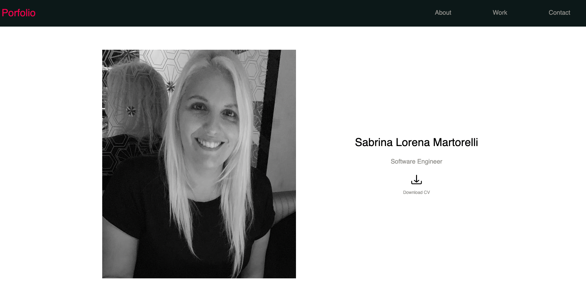

# Porfolio Sabrina Martorelli

## Description

This is the porfolio of Sabrina Martorelli with a codebase that follows accessibility standards and is optimized for search engines.

## Installation

N/A 

## Usage

On this webpage the main content presents product cards with detailed descriptions.   The navigation bar at the top of the page links to the specific sections within the page: About, Work and Contact. 
In the about section the site presents a description of Sabrina's history.
In the Work section the sites present a collection of resent work.
In the Contact section the site present all the way to contact Sabrina.

  

## Credits
https://www.w3schools.com/ - How to create a portfolio.
https://placeimg.com/ - Hundreds of millions of images served.
https://www.flaticon.com/ - Access 8.4M+ vector icons and stickers.
https://colorpalettes.net/ - Resource that helps you in color selection.

## License

MIT Licence

## Deployment link

https://sabrina-martorelli.github.io/porfolio/

