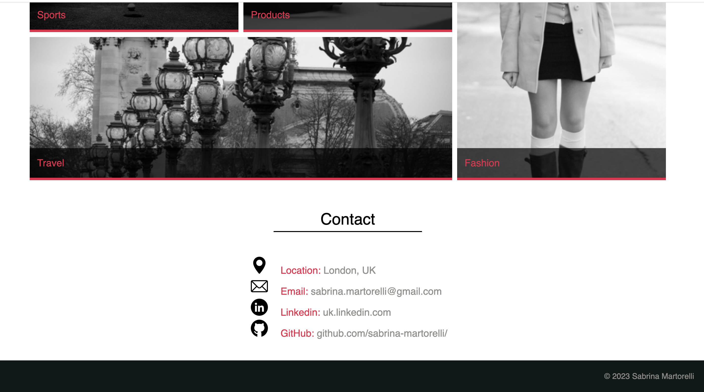

# Porfolio Sabrina Martorelli

## Description

This is the porfolio of Sabrina Martorelli with a codebase that follows accessibility standards and is optimized for search engines.

## Installation

N/A 

## Usage

On this webpage the main content presents product cards with detailed descriptions.   The navigation bar at the top of the page links to the specific sections within the page: About, Work and Contact. 
In the about section the site presents a description of Sabrina's history.
In the Work section the sites present a collection of resent work.
In the Contact section the site present all the way to contact Sabrina.

  

## Credits

1. https://www.w3schools.com/ - How to create a portfolio.
2. https://placeimg.com/ - Hundreds of millions of images served.
3. https://www.flaticon.com/ - Access 8.4M+ vector icons and stickers.
4. https://colorpalettes.net/ - Resource that helps you in color selection.

## License

The MIT License (MIT)

Copyright (c) 2022 Sabrina Martorelli

Permission is hereby granted, free of charge, to any person obtaining a copy of this software and associated documentation files (the "Software"), to deal in the Software without restriction, including without limitation the rights to use, copy, modify, merge, publish, distribute, sublicense, and/or sell copies of the Software, and to permit persons to whom the Software is furnished to do so, subject to the following conditions:

The above copyright notice and this permission notice shall be included in all copies or substantial portions of the Software.

THE SOFTWARE IS PROVIDED "AS IS", WITHOUT WARRANTY OF ANY KIND, EXPRESS OR IMPLIED, INCLUDING BUT NOT LIMITED TO THE WARRANTIES OF MERCHANTABILITY, FITNESS FOR A PARTICULAR PURPOSE AND NONINFRINGEMENT. IN NO EVENT SHALL THE AUTHORS OR COPYRIGHT HOLDERS BE LIABLE FOR ANY CLAIM, DAMAGES OR OTHER LIABILITY, WHETHER IN AN ACTION OF CONTRACT, TORT OR OTHERWISE, ARISING FROM, OUT OF OR IN CONNECTION WITH THE SOFTWARE OR THE USE OR OTHER DEALINGS IN THE SOFTWARE.

## Deployment link

https://sabrina-martorelli.github.io/porfolio/

